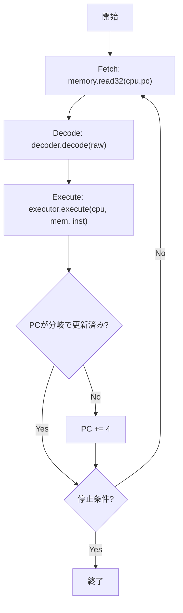

# RV32I エミュレータ in Zig -- 実装ロードマップ

## 参考資料

- [RISC-V Unprivileged ISA Specification (Chapter 2: RV32I)](https://docs.riscv.org/reference/isa/unpriv/unpriv-index.html)
- [Verylで作るCPU](https://cpu.kanataso.net/00-preface.html) -- 特に第3章「RV32Iの実装」の構成を参考
- [A RISC-V emulator in Zig, Part 1](https://undeleted.ronsor.com/a-risc-v-emulator-in-zig-part-1-instruction-decoding/) -- Zigでのデコード手法の参考

## 現在の状態

- プロジェクトは `zig init` 直後のスケルトン状態（[build.zig](build.zig), [src/main.zig](src/main.zig)）
- Zig のビルドシステムは動作確認済み

---

## Phase 0: 基盤設計（CPU / メモリの型定義）

**目的**: エミュレータの骨格となるデータ構造を定義する

### やること

- `src/cpu.zig` -- CPU 構造体を定義
  - レジスタファイル: `x: [32]u32`（x0 は常に 0）
  - プログラムカウンタ: `pc: u32`
  - `init()`, `reset()` 関数
- `src/memory.zig` -- メモリ構造体を定義
  - フラットなバイト配列ベースのメモリ（例: 64KB〜1MB）
  - `read8/16/32()`, `write8/16/32()` -- リトルエンディアン
  - ミスアラインアクセスのエラー処理
    - エラー処理めんどくさいので、後回し

### Zig 学習ポイント

- 構造体 (`struct`)、配列、`@intCast` などのビルトイン
- エラーハンドリング (`error union`, `!`)
- `std.mem.readInt` / `writeInt` の活用

---

## Phase 1: 命令デコーダ

**目的**: 32ビット命令語から各フィールドを抽出する

### RV32I の6つの命令フォーマット

```
R-type: [funct7|rs2|rs1|funct3|rd|opcode]
I-type: [imm[11:0]|rs1|funct3|rd|opcode]
S-type: [imm[11:5]|rs2|rs1|funct3|imm[4:0]|opcode]
B-type: [imm[12|10:5]|rs2|rs1|funct3|imm[4:1|11]|opcode]
U-type: [imm[31:12]|rd|opcode]
J-type: [imm[20|10:1|11|19:12]|rd|opcode]
```

### やること

- `src/decoder.zig` -- 命令デコード
  - `Instruction` union/enum で命令種別を表現
  - opcode（下位7ビット）で命令フォーマットを判別
  - funct3 / funct7 で具体的な命令を特定
  - 即値（immediate）の符号拡張処理

### Zig 学習ポイント

- packed struct, ビット演算 (`>>`, `&`, `@bitCast`)
- `switch` 式、`enum`, tagged union
- `@as()` によるキャスト

---

## Phase 2: ALU命令の実装（計算系命令）

**目的**: レジスタ間演算・即値演算を動かす

### 対象命令（19命令）

- **R-type**: ADD, SUB, SLL, SLT, SLTU, XOR, SRL, SRA, OR, AND
- **I-type**: ADDI, SLTI, SLTIU, XORI, ORI, ANDI, SLLI, SRLI, SRAI
- **U-type**: LUI, AUIPC

### やること

- `src/executor.zig` -- 命令実行ロジック
  - `execute(cpu, instruction)` 関数
  - x0 への書き込みを無視する制約の実装
  - PC のインクリメント（通常 +4）
- フェッチ→デコード→実行のメインループを `main.zig` に実装

### テスト

- `zig build test` でユニットテスト
  - ADDI x1, x0, 42 → x1 == 42 の確認
  - LUI + ADDI で32ビット即値ロードの確認

---

## Phase 3: メモリアクセス命令

**目的**: ロード/ストア命令でメモリ操作を実装

### 対象命令（8命令）

- **Load (I-type)**: LB, LH, LW, LBU, LHU
- **Store (S-type)**: SB, SH, SW

### やること

- 符号拡張（LB/LH）とゼロ拡張（LBU/LHU）の正しい実装
- S-type の即値デコード（2つのフィールドに分割されている）
- メモリのアドレス計算: `base(rs1) + offset(imm)`

---

## Phase 4: 分岐・ジャンプ命令

**目的**: 制御フロー命令を実装し、ループや条件分岐を動かす

### 対象命令（8命令）

- **B-type**: BEQ, BNE, BLT, BGE, BLTU, BGEU
- **J-type**: JAL
- **I-type**: JALR

### やること

- B-type の即値デコード（ビットが散在している）
- J-type の即値デコード（同様にビットが散在）
- 分岐先アドレスの計算: `PC + offset`
- JALR のアドレス計算: `(rs1 + offset) & ~1`
- PC 更新ロジックの統合（分岐成立時はPC+4しない）

---

## Phase 5: システム命令・FENCE

**目的**: 残りの命令を実装し、RV32I 全命令を完成させる

### 対象命令

- **ECALL**: 環境呼び出し（シンプルなシステムコールエミュレーション）
- **EBREAK**: デバッガブレーク
- **FENCE**: メモリオーダリング（エミュレータではNOPで可）

### やること

- ECALL で最低限の I/O（例: a7 レジスタの値に応じて stdout への出力）
- EBREAK でエミュレータを停止

---

## Phase 6: バイナリローダ

**目的**: 実際のRISC-Vバイナリを読み込んで実行する

### やること

- ELFローダの実装（最低限のELFパーサ）
  - ELFヘッダの読み込み、マジックナンバー検証
  - プログラムヘッダのパース、LOAD セグメントをメモリに配置
  - エントリポイントの取得と PC への設定
- フラットバイナリ（raw binary）のロードも対応
- コマンドライン引数でバイナリファイルパスを受け取る

### Zig 学習ポイント

- ファイルI/O (`std.fs`)
- コマンドライン引数のパース (`std.process.args`)
- スライス操作

---

## Phase 7: テストとデバッグ機能

**目的**: 正しさの検証とデバッグ効率の向上

### やること

- **riscv-tests** の活用
  - [riscv-software-src/riscv-tests](https://github.com/riscv-software-src/riscv-tests) のRV32I用テストバイナリを実行
  - PASS/FAIL の判定（ECALL によるテスト結果通知）
- デバッグ機能
  - ステップ実行モード
  - レジスタダンプ（実行ごとにレジスタの状態を表示）
  - 逆アセンブル表示（実行中の命令をニーモニックで表示）
  - メモリダンプ
- `std.log` によるログレベル制御

---

## Phase 8: 発展（オプション）

目標達成後に興味に応じて拡張:

- **Zicsr拡張**: CSR（制御・状態レジスタ）の実装（「Verylで作るCPU」第4章に対応）
- **M拡張**: 乗算・除算命令（MUL, DIV, REM など）
- **RV64I**: 64ビットへの拡張
- **簡易デバッガ (REPL)**: ブレークポイント設定、ウォッチポイント
- **パフォーマンス計測**: 実行命令数カウント、IPC表示

---

## 推奨するファイル構成

```
riscv-zig/
  build.zig
  src/
    main.zig        -- エントリポイント、メインループ
    cpu.zig          -- CPU構造体（レジスタ、PC）
    memory.zig       -- メモリ構造体（read/write）
    decoder.zig      -- 命令デコーダ
    executor.zig     -- 命令実行エンジン
    instruction.zig  -- 命令の型定義（enum/union）
    elf.zig          -- ELFローダ（Phase 6）
```

## 全体の流れ（フェッチ-デコード-実行サイクル）




